## Создание базы данных
### Диаграмма

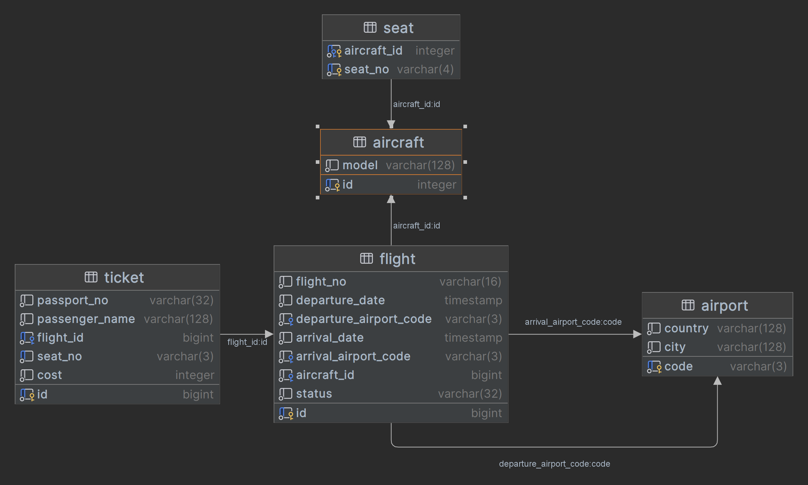

### Создание таблиц

```sql
CREATE DATABASE flight_repo;
CREATE SCHEMA flights;
```

```sql
-- Таблица "Аэропорт"
CREATE TABLE airport
(
    code    varchar(3) PRIMARY KEY,
    country varchar(128) NOT NULL,
    city    varchar(128) NOT NULL
);
```

```sql
-- Таблица "Самолёт"
CREATE TABLE aircraft
(
    id    serial PRIMARY KEY,
    model varchar(128) NOT NULL
);
```

```sql
-- Таблица "Место в самолете"
CREATE TABLE seat
(
    aircraft_id int REFERENCES aircraft (id),
    seat_no     varchar(4) NOT NULL,
    PRIMARY KEY (aircraft_id, seat_no)
);
```

```sql
-- Таблица "Рейс"
CREATE TABLE flight
(
    id                     bigserial PRIMARY KEY,
    flight_no              varchar(16)                          NOT NULL,
    departure_date         timestamp                            NOT NULL,
    departure_airport_code varchar(3) REFERENCES airport (code) NOT NULL,
    arrival_date           timestamp                            NOT NULL,
    arrival_airport_code   varchar(3) REFERENCES airport (code) NOT NULL,
    aircraft_id            bigint REFERENCES aircraft (id)      NOT NULL,
    status                 varchar(32)                          NOT NULL
);
```

```sql
-- Таблица "Билет"
CREATE TABLE ticket
(
    id             bigserial PRIMARY KEY,
    passport_no    varchar(32)                   NOT NULL,
    passenger_name varchar(128)                  NOT NULL,
    flight_id      bigint REFERENCES flight (id) NOT NULL,
    seat_no        varchar(3)                    NOT NULL,
    cost           int                           NOT NULL,
    UNIQUE (flight_id, seat_no)
);
```

### Заполнение таблиц

```sql
INSERT INTO airport (code, country, city)
VALUES ('MNK', 'Беларусь', 'Минск'),
       ('LDN', 'Англия', 'Лондон'),
       ('MSK', 'Россия', 'Москва'),
       ('BSL', 'Испания', 'Барселона');

INSERT INTO aircraft (model)
VALUES ('Боинг 777-300'),
       ('Боинг 737-300'),
       ('Аэробус A320-200'),
       ('Суперджет-100');

INSERT INTO seat (aircraft_id, seat_no)
SELECT id, s.column1
FROM aircraft
         CROSS JOIN (VALUES ('A1'), ('A2'), ('B1'), ('B2'), ('C1'), ('C2'), ('D1'), ('D2') ORDER BY 1) s;

INSERT INTO flight (flight_no, departure_date, departure_airport_code, arrival_date, arrival_airport_code, aircraft_id,
                    status)
VALUES ('MN3002', '2020-06-14T14:30', 'MNK', '2020-06-14T18:07', 'LDN', 1, 'ARRIVED'),
       ('MN3002', '2020-06-16T09:15', 'LDN', '2020-06-16T13:00', 'MNK', 1, 'ARRIVED'),
       ('BC2801', '2020-07-28T23:25', 'MNK', '2020-07-29T02:43', 'LDN', 2, 'ARRIVED'),
       ('BC2801', '2020-08-01T11:00', 'LDN', '2020-08-01T14:15', 'MNK', 2, 'DEPARTED'),
       ('TR3103', '2020-05-03T13:10', 'MSK', '2020-05-03T18:38', 'BSL', 3, 'ARRIVED'),
       ('TR3103', '2020-05-10T07:15', 'BSL', '2020-05-10T012:44', 'MSK', 3, 'CANCELLED'),
       ('CV9827', '2020-09-09T18:00', 'MNK', '2020-09-09T19:15', 'MSK', 4, 'SCHEDULED'),
       ('CV9827', '2020-09-19T08:55', 'MSK', '2020-09-19T10:05', 'MNK', 4, 'SCHEDULED'),
       ('QS8712', '2020-12-18T03:35', 'MNK', '2020-12-18T06:46', 'LDN', 2, 'ARRIVED');


INSERT INTO ticket (passport_no, passenger_name, flight_id, seat_no, cost)
VALUES ('112233', 'Иван Иванов', 1, 'A1', 200),
       ('23234A', 'Петр Петров', 1, 'B1', 180),
       ('SS988D', 'Светлана Светикова', 1, 'B2', 175),
       ('QYASDE', 'Андрей Андреев', 1, 'C2', 175),
       ('POQ234', 'Иван Кожемякин', 1, 'D1', 160),
       ('898123', 'Олег Рубцов', 1, 'A2', 198),
       ('555321', 'Екатерина Петренко', 2, 'A1', 250),
       ('QO23OO', 'Иван Розмаринов', 2, 'B2', 225),
       ('9883IO', 'Иван Кожемякин', 2, 'C1', 217),
       ('123UI2', 'Андрей Буйнов', 2, 'C2', 227),
       ('SS988D', 'Светлана Светикова', 2, 'D2', 277),
       ('EE2344', 'Дмитрий Трусцов', 3, 'А1', 300),
       ('AS23PP', 'Максим Комсомольцев', 3, 'А2', 285),
       ('322349', 'Эдуард Щеглов', 3, 'B1', 99),
       ('DL123S', 'Игорь Беркутов', 3, 'B2', 199),
       ('MVM111', 'Алексей Щербин', 3, 'C1', 299),
       ('ZZZ111', 'Денис Колобков', 3, 'C2', 230),
       ('234444', 'Иван Старовойтов', 3, 'D1', 180),
       ('LLLL12', 'Людмила Старовойтова', 3, 'D2', 224),
       ('RT34TR', 'Степан Дор', 4, 'A1', 129),
       ('999666', 'Анастасия Шепелева', 4, 'A2', 152),
       ('234444', 'Иван Старовойтов', 4, 'B1', 140),
       ('LLLL12', 'Людмила Старовойтова', 4, 'B2', 140),
       ('LLLL12', 'Роман Дронов', 4, 'D2', 109),
       ('112233', 'Иван Иванов', 5, 'С2', 170),
       ('NMNBV2', 'Лариса Тельникова', 5, 'С1', 185),
       ('DSA586', 'Лариса Привольная', 5, 'A1', 204),
       ('DSA583', 'Артур Мирный', 5, 'B1', 189),
       ('DSA581', 'Евгений Кудрявцев', 6, 'A1', 204),
       ('EE2344', 'Дмитрий Трусцов', 6, 'A2', 214),
       ('AS23PP', 'Максим Комсомольцев', 6, 'B2', 176),
       ('112233', 'Иван Иванов', 6, 'B1', 135),
       ('309623', 'Татьяна Крот', 6, 'С1', 155),
       ('319623', 'Юрий Дувинков', 6, 'D1', 125),
       ('322349', 'Эдуард Щеглов', 7, 'A1', 69),
       ('DIOPSL', 'Евгений Безфамильная', 7, 'A2', 58),
       ('DIOPS1', 'Константин Швец', 7, 'D1', 65),
       ('DIOPS2', 'Юлия Швец', 7, 'D2', 65),
       ('1IOPS2', 'Ник Говриленко', 7, 'C2', 73),
       ('999666', 'Анастасия Шепелева', 7, 'B1', 66),
       ('23234A', 'Петр Петров', 7, 'C1', 80),
       ('QYASDE', 'Андрей Андреев', 8, 'A1', 100),
       ('1QAZD2', 'Лариса Потемнкина', 8, 'A2', 89),
       ('5QAZD2', 'Карл Хмелев', 8, 'B2', 79),
       ('2QAZD2', 'Жанна Хмелева', 8, 'С2', 77),
       ('BMXND1', 'Светлана Хмурая', 8, 'В2', 94),
       ('BMXND2', 'Кирилл Сарычев', 8, 'D1', 81),
       ('SS988D', 'Светлана Светикова', 9, 'A2', 222),
       ('SS978D', 'Андрей Желудь', 9, 'A1', 198),
       ('SS968D', 'Дмитрий Воснецов', 9, 'B1', 243),
       ('SS958D', 'Максим Гребцов', 9, 'С1', 251),
       ('112233', 'Иван Иванов', 9, 'С2', 135),
       ('NMNBV2', 'Лариса Тельникова', 9, 'B2', 217),
       ('23234A', 'Петр Петров', 9, 'D1', 189),
       ('123951', 'Полина Зверева', 9, 'D2', 234);
```

## Запросы
```sql
-- 1. Кто летел рейсом Минск (MNK) - Лондон (LDN) 2020-07-28 на месте B1
SELECT t.passport_no,
       t.passenger_name,
       f.flight_no,
       t.seat_no,
       f.departure_date,
       f.departure_airport_code,
       f.arrival_airport_code
FROM ticket t
         JOIN flight f ON f.id = t.flight_id
WHERE f.departure_airport_code = 'MNK'
  AND f.arrival_airport_code = 'LDN'
  AND f.departure_date BETWEEN '2020-07-28' AND '2020-07-29'
  AND t.seat_no = 'B1';
```

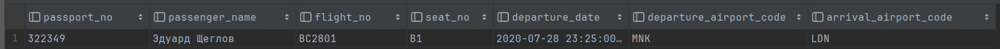

---
```sql
-- 2. Какие 2 перелета были самые длительные за все время
SELECT id,
       flight_no,
       departure_date,
       departure_airport_code,
       arrival_airport_code,
       extract(MINUTE FROM arrival_date - flight.departure_date) AS flight_time_minutes
FROM flight
ORDER BY flight_time_minutes DESC
    LIMIT 2;
```

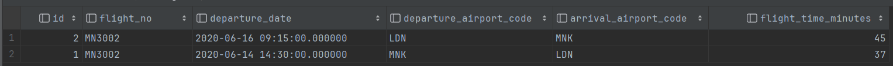

---
```sql
-- 3. Какая максимальная и минимальная продолжительность перелетов между Минском и Лондоном и сколько было всего таких перелетов
SELECT min(extract(MINUTE FROM arrival_date - flight.departure_date)) AS min_minutes,
       max(extract(MINUTE FROM arrival_date - flight.departure_date)) AS max_minutes,
       count(*)
FROM flight
WHERE departure_airport_code = 'MNK'
  AND arrival_airport_code = 'LDN'
GROUP BY departure_airport_code, arrival_airport_code;
```

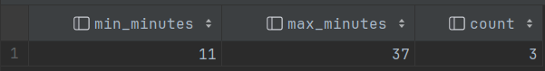

---
```sql
-- 4. Сколько мест осталось незанятыми 2020-06-14 на рейсе MN3002
-- 4.1 Все занятые места на рейсе MN3002 2020-06-14
SELECT seat_no
FROM flight f
         JOIN ticket t ON f.id = t.flight_id
WHERE f.flight_no = 'MN3002'
  AND f.departure_date::date = '2020-06-14';
```

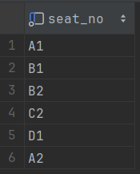

```sql
-- 4.2 Все потенциально возможные места которые могут быть на рейсе MN3002 2020-06-14
SELECT seat_no
FROM seat s
         JOIN aircraft a ON a.id = s.aircraft_id
         JOIN flight f ON a.id = f.aircraft_id
WHERE f.flight_no = 'MN3002'
  AND f.departure_date::date = '2020-06-14';
```

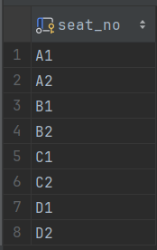

```sql
-- 4.3 Итоговый запрос, используя 4.2 и 4.1
SELECT count(seat_no)
FROM seat s
         JOIN aircraft a ON a.id = s.aircraft_id
         JOIN flight f ON a.id = f.aircraft_id
WHERE f.flight_no = 'MN3002'
  AND f.departure_date::date = '2020-06-14'
  AND seat_no NOT IN (SELECT seat_no
                      FROM flight f
                               JOIN ticket t ON f.id = t.flight_id
                      WHERE f.flight_no = 'MN3002'
                        AND f.departure_date::date = '2020-06-14');
```

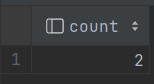

---
```sql
-- 5. Какие имена встречаются чаще всего и какую долю от числа всех пассажиров они составляют
-- 5.1 Вариант решения 1
SELECT SPLIT_PART(passenger_name, ' ', 1)            AS name,
       round((count(*)::numeric / (SELECT COUNT(DISTINCT SPLIT_PART(passenger_name, ' ', 1))
FROM ticket)), 2) as part
FROM ticket t
GROUP BY name
ORDER BY name;
```

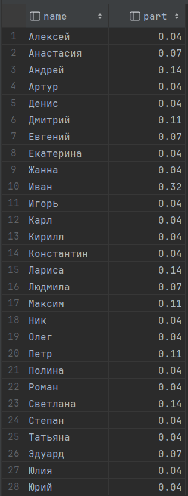

```sql
-- 5.2 Вариант решения 2
SELECT SPLIT_PART(passenger_name, ' ', 1) AS name, round(count(*)::numeric / t2.total_count, 2) AS part
FROM ticket t1
         CROSS JOIN (SELECT count(DISTINCT SPLIT_PART(passenger_name, ' ', 1)) AS total_count FROM ticket) t2
GROUP BY name, total_count
ORDER BY name;
```

Результат аналогичен.

---
```sql
-- 6. Вывести имена пассажиров и сколько билетов пассажир купил за все время(*)
SELECT passport_no, passenger_name, count(*) AS total_ticket_count
FROM ticket
GROUP BY passport_no, passenger_name
ORDER BY total_ticket_count DESC;
```

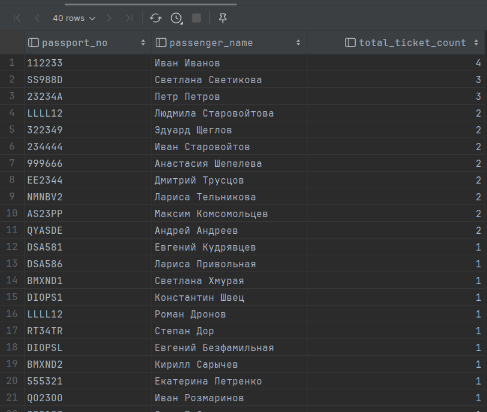

---
**Для запроса 7 будем считать, что:**
- Маршрут - полёт самолета в одну сторону, то есть из города А в город Б, при этом полет из Б в А - это уже другой маршрут.
- Cтоимость маршрута - это стоимость всех купленных билетов каждого рейса по данному маршруту. Например, если было два рейса Минск - Лондон, в первом рейсе было куплено 2 билета ценой по 100 усл. ед., а во втором маршруте три билета ценой по 150 усл. ед., то стоимость маршрута = 2 * 100 + 3 * 150 = 650 усл. ед.

```sql
-- 7. Вывести стоимость всех маршрутов по убыванию(*)
SELECT departure_airport_code, arrival_airport_code, sum(cost) as total_price
FROM ticket t
         JOIN flight f ON t.flight_id = f.id
GROUP BY departure_airport_code, arrival_airport_code
ORDER BY total_price DESC;
```

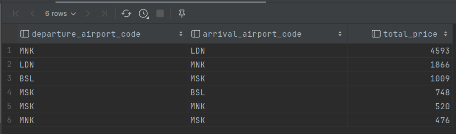

---
```sql
-- 8. Отобразить разницу в стоимости между текущим и ближайшими маршрутами в отсортированном списке
-- 8.1 Находим стоимость определенного маршрута (Пусть это будет LDN - MNK)
SELECT departure_airport_code, arrival_airport_code, sum(cost) as total_price
FROM ticket t
         JOIN flight f ON t.flight_id = f.id
WHERE departure_airport_code = 'LDN'
  AND arrival_airport_code = 'MNK'
GROUP BY departure_airport_code, arrival_airport_code;
```

```sql
SELECT departure_airport_code,
       arrival_airport_code,
       (sum(cost) - (SELECT sum(cost) as total_price
                     FROM ticket t
                              JOIN flight f ON t.flight_id = f.id
                     WHERE departure_airport_code = 'LDN'
                       AND arrival_airport_code = 'MNK'
                     GROUP BY departure_airport_code, arrival_airport_code
                     ORDER BY total_price DESC)) as diff_price
FROM ticket t
         JOIN flight f
              ON t.flight_id = f.id
GROUP BY departure_airport_code, arrival_airport_code
ORDER BY diff_price DESC;
```

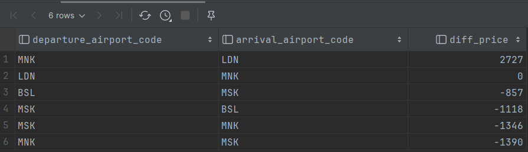